# Gundam Model Kits — Material Science Project (MCCI 2026)

> A comprehensive analysis of Bandai HG 1/144 Wing Gundam plastic model kits: polymer chemistry, manufacturing, assembly, design, cultural impact, and environmental footprint.

---

## Table of Contents

1. [Cultural Significance](#1-cultural-significance)
2. [Plastic Origin](#2-plastic-origin)
3. [Manufacturing Process](#3-manufacturing-process)
4. [Material Properties](#4-material-properties)
5. [Environmental Impact](#5-environmental-impact)
6. [Assembly Guide](#6-assembly-guide)
7. [Historical Context](#7-historical-context)
8. [Design Analysis](#8-design-analysis)
9. [Conclusion & Sources](#9-conclusion--sources)

---

## 1. Cultural Significance

**Board A** — *How a plastic model kit became a global hobby without requiring anyone to watch the show.*

*Image credit: Bandai Namco Filmworks*

### 1.1 Personal Entry Point

I grew up around GunPla, even though I was never brave enough to actually build them as a kid. My dad usually had one or two displayed in the cabinet next to our dining table, and I remember being drawn to their precision. They were small, detailed, articulated objects that felt more engineered than playful. They did not really register with me as toys; instead, they were art that had been designed, manufactured, assembled, and posed with intention. I have still only watched maybe three episodes of *Mobile Suit Gundam*, so my interest in Gundam does not really come from the anime itself. It comes from the physical kits: the parts, the runners, the snap-fit joints, the layered armor, and the process of turning plastic pieces into something that feels mechanically believable.

### 1.2 Cultural Identity Beyond the Anime

Gundam plastic models, usually shortened to "GunPla," sit in a strange middle ground between consumer product, engineered object, hobby material, and cultural artifact. Their value does not depend entirely on whether someone has watched the source material. A GunPla kit is meaningful for its design, assembly experience, plastic quality, articulation, color separation, and display value, not solely for the story or character it represents.

### 1.3 Accessibility and Skill Progression

A beginner can buy a small Entry Grade or High Grade kit for roughly the price of a meal, with U.S. retail examples around $10-21 for Entry Grade RX-78-2 and HGAC Wing Gundam kits, while more complex Perfect Grade kits can be hundreds of dollars; PG Unleashed RX-78-2 was listed around $299 in one current retail example. Someone can start with a simple snap-fit kit and no paint, glue, or specialized tools, then gradually move toward sanding, panel lining, painting, weathering, kitbashing, and full custom builds.

### 1.4 Scale and Community

Bandai Namco's 2025 Fact Book reports **810.72 million cumulative shipments** of Gundam series model kits as of March 2025. The community is international — builders share work-in-progress photos, custom paint jobs, competition builds, reviews, tutorials, and display setups across forums, YouTube, Reddit, Instagram, conventions, and official events.

*Life-size Gundam display in a mall near my home in Vancouver.*

| Statistic | Value |
|-----------|------:|
| First GunPla kit released | 1980 |
| Children in GunPla Academia by March 2024 | 520K+ |
| Elementary schools engaged by March 2024 | 7,100 |

> **Scale of Impact:** Bandai Spirits' 2024 Hobby Center expansion plan lists 10 multi-color molding machines and 84 mono-color molding machines at full operation, with production expected to rise by approximately 35% compared with fiscal 2023.

---

## 2. Plastic Origin

**Board B** — *What the runners are actually made of, and how I know.*

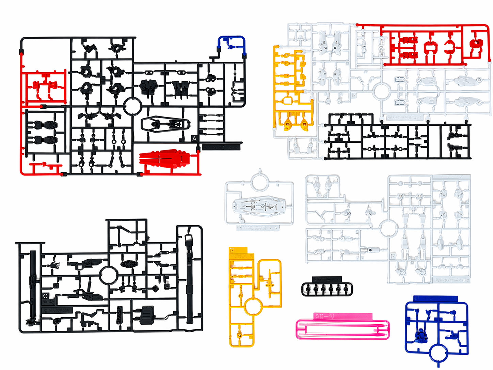
*Figure 1. The full HG 1/144 Wing Gundam runner set. Each runner is a single mold cycle's worth of parts — rigid structural runners are styrenic (HIPS / PS-rich HIPS), while the small dark runner is the polyethylene polycap frame (PC7).*

### 2.1 Why I Started Asking

As a kid I assumed the parts of a GunPla kit were all the same plastic because they all came in the same box. I also assumed that the McRib actually had baby back ribs in them. Both turned out to be false. While the white armor pieces are stiff and glossy, the little black bushings between the joints are soft, slightly waxy, and visibly different even without pigment.

I sampled three plastic forms from a Bandai HG 1/144 Wing Gundam kit and analyzed each by FTIR spectroscopy in attenuated-total-reflectance (ATR) mode:

- **SB-13** — rigid, glassy runner sample
- **Board A** — rigid, glassy runner sample
- **PC7** — polycap runner of black, rubber-like joint inserts

| Statistic | Value |
|-----------|------:|
| Plastic forms checked by FTIR | 3 |
| Styrenic rigid plastic per HG 1/144 kit | ~30 g |
| LLDPE polycaps per kit | ~5 g |

### 2.2 SB-13 Runner — High Impact Polystyrene (HIPS)

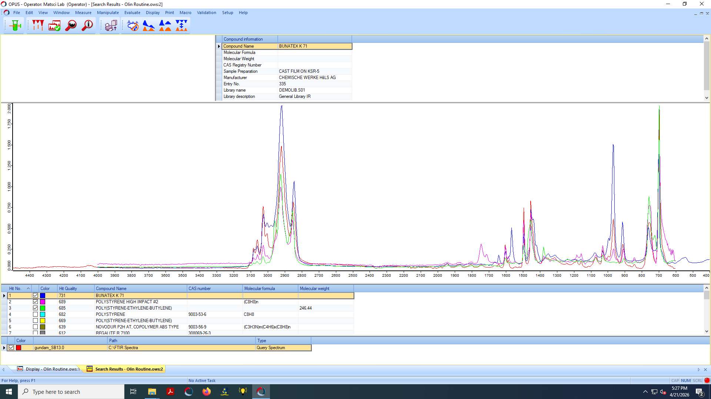
*Figure 2. FTIR-ATR spectrum for SB-13 — library hits consistent with high-impact / rubber-modified polystyrene.*

The top three FTIR matches were "Polystyrene High Impact (Butyl)", "Bunatex" (a polybutadiene rubber brand), and a polystyrene-ethylene-butylene block copolymer. All converge on **High Impact Polystyrene (HIPS)** — a rubber-toughened polystyrene.

HIPS is a rubber-modified thermoplastic in which 5–15 wt.% polybutadiene is dispersed as roughly 1–3 μm domains throughout a rigid polystyrene continuous phase. The rubber phase absorbs and dissipates impact energy by initiating multiple silver-craze bands rather than allowing a single fast-propagating crack.

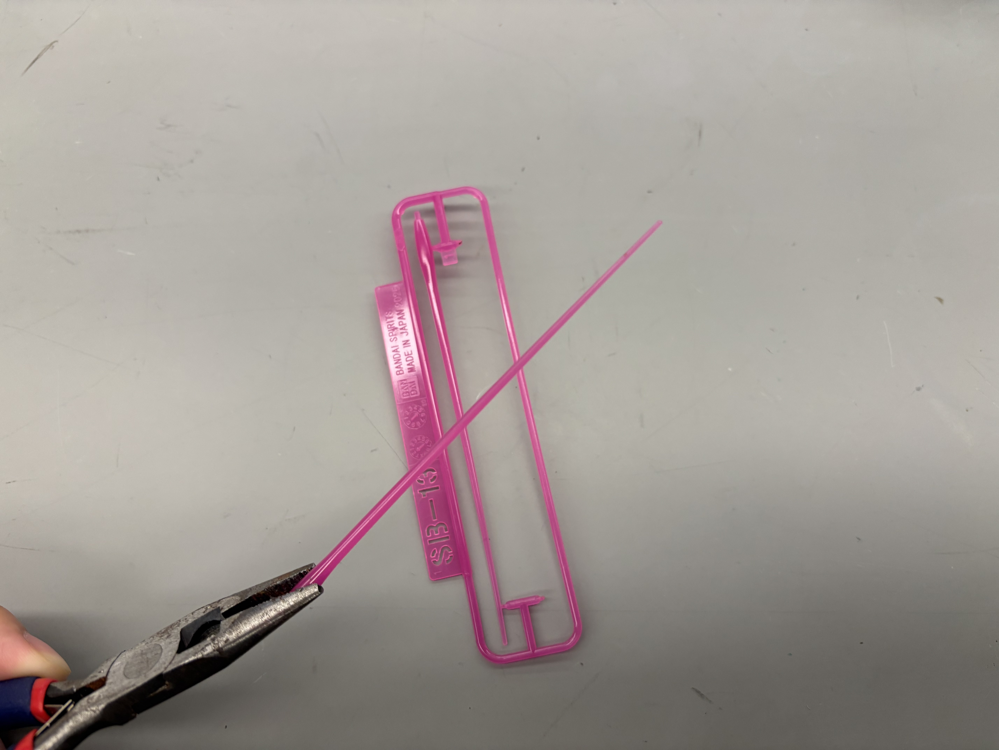
*Figure 3. SB-13 runner sample held in tweezers after cutting.*

### 2.3 Board A Runner — PS-Rich Styrenic Blend

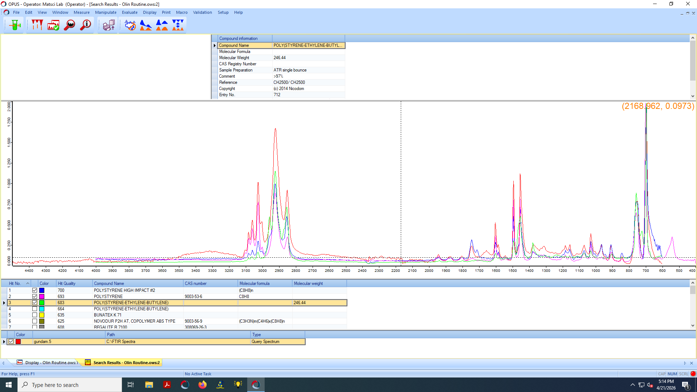
*Figure 4. FTIR-ATR spectrum for Board A — library hits in the styrenic family, but with a plain-polystyrene match suggesting a PS-rich formulation.*

Board A's top matches: "Polystyrene High Impact #2", "Polystyrene", and "Poly(styrene-ethylene-butylene)". All contain a styrenic component, putting Board A in the same broad family as SB-13.

**Assignment: PS-rich styrenic hard-runner plastic.** The kit uses multiple styrenic formulations for hard parts, plus polyethylene for the flexible joint inserts.

### 2.4 PC7 Runner — Polyethylene-Based Polycap

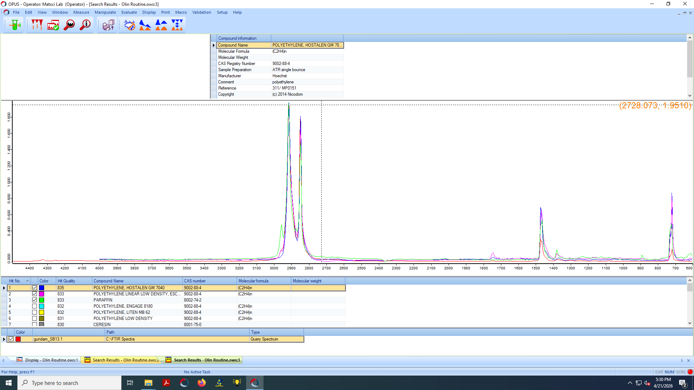
*Figure 5. FTIR-ATR spectrum for PC7 — library matches cluster on polyethylene grades (e.g. LLDPE-class Hostalen references).*

The PC7 runner supplies the dark polycap parts that act as joint bushings. Top matches: "Polyethylene Hostalen GM 7040" (LyondellBasell), "Polyethylene linear low density", and "Paraffin" — consistent with a polyethylene-based polycap, with paraffin likely present as a processing aid.

The pliability comes from polyethylene's intrinsic combination of high backbone flexibility and partial crystallinity (≈30–55% for LLDPE) — not from a rubber blend.

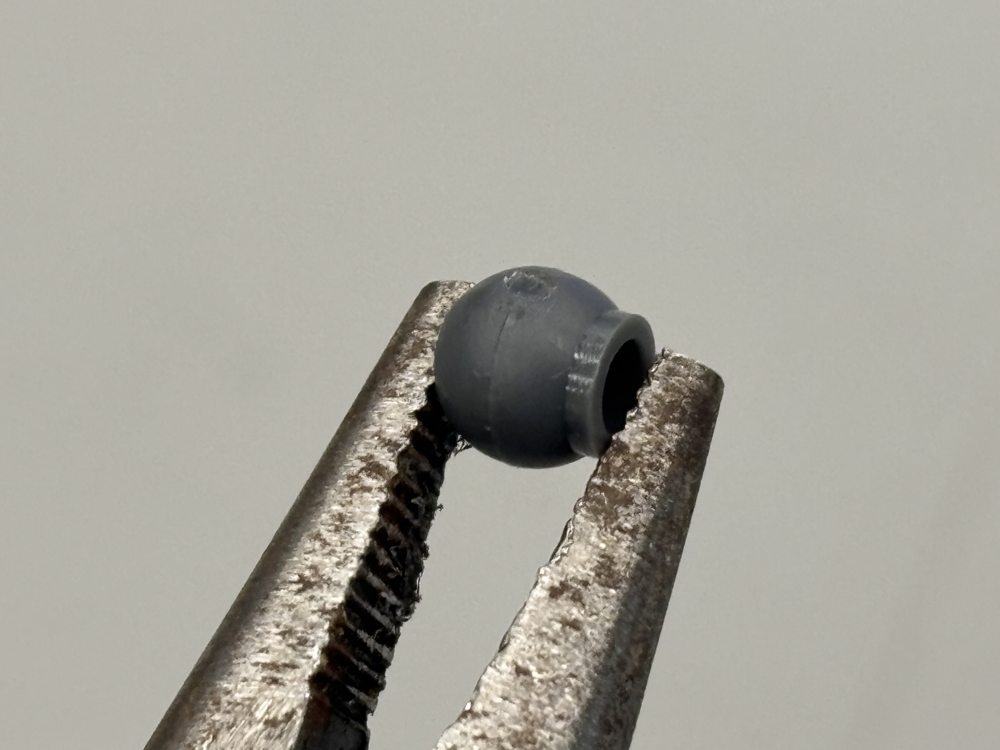
*Figure 6. A single PC7 polycap. LLDPE's low modulus and partial crystallinity means the bushing can deform locally to accept a HIPS peg, then spring back to maintain joint grip.*

### 2.5 Why These Polymer Families?

Pairing a stiff amorphous styrenic runner family with a soft semicrystalline polyolefin is not a cost decision. SB-13 and Board A supply rigid parts with fine surface detail and paint receptivity. LLDPE supplies compliant polycap joints with elastic recovery and low surface energy for smooth re-posing.

> **Engineering Decision:** Stiff matrix plus compliant joint is the same strategy used in interference-fit medical-device hubs and automotive grommets — GunPla applies it at toy scale, with the additional constraint that the consumer must be able to assemble the joint with bare hands and no adhesive.

---

## 3. Manufacturing Process

**Board C** — *How GunPla is produced at scale, and what makes Bandai's process different.*

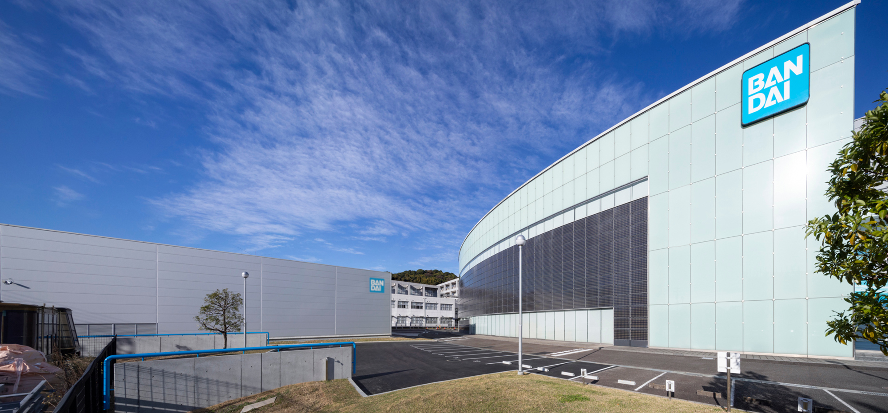
*Figure 1. The Bandai Hobby Center in Shizuoka, Japan. Source: Bandai MIRAICREATION.*

### 3.1 What I Wanted to Understand

Bandai's process is standard injection molding — the same physics as a plastic bottle cap or a Lego brick — with two extensions: **System Injection multi-color molding** and **tightly toleranced cavities** tuned for snap-fit assembly. The "no paint required" promise of an HG kit comes from these two technical decisions.

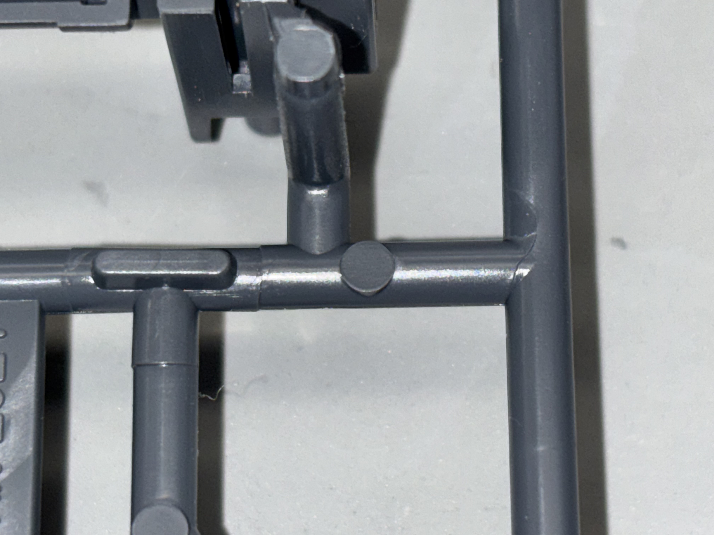
*Figure 2. Molded styrenic runner junction — glossy surface and gate geometry are visual evidence of injection fill and mold-wall freezing.*

| Statistic | Value |
|-----------|------:|
| Multi-color molding machines planned for full FY2026 operation | 10 |
| Mono-color molding machines planned for full FY2026 operation | 84 |
| Expected production increase versus fiscal 2023 | 35% |

> **Why It Matters:** Multi-color runners reduce packaging volume and eliminate post-processing painting. That is how the "no paint required" HG promise works at scale.

### 3.2 Process Steps

1. **Pellet Drying** — HIPS and polyethylene pellets dried under hot air (70–80 °C for HIPS, 60–70 °C for PE) to reduce moisture below ≈0.05 wt.%.
2. **Plasticization** — Reciprocating screw extruder melts dried pellets at ≈200–240 °C for HIPS and ≈180–240 °C for LLDPE.
3. **Injection** — Screw advances axially as piston, driving melt through hot-runner system into cooled mold cavity at 50–150 MPa.
4. **Multi-Color Sequencing** — Mold contains gates for up to four colors. After first color injected, its gates close, next color's gates open, and a different barrel injects the next polymer.
5. **Cooling and Ejection** — Cooling channels maintain tool at ≈30–60 °C; cycle times 30–60 s. Ejector pins push runner out; take-out robot moves it to inspection.
6. **Packaging** — Inspected runners sealed in polyethylene bags with manual and decals, then boxed.

*Figure 3. Multi-color injection molding machine. Source: Bandai MIRAICREATION.*

### 3.3 Why Multi-Color Molding Is Non-Trivial

The same mold cavity must hold molten polymer at very different bulk viscosities without bleeding color. HIPS at 220 °C has a melt viscosity roughly an order of magnitude higher than LLDPE at the same temperature, meaning gate diameters and runner geometries are tuned per polymer.

*Figure 4. Finished multi-color runner set. Separate color shots are injected into the same tool and held apart by gate sequencing, core pins, and shutoff geometry.*

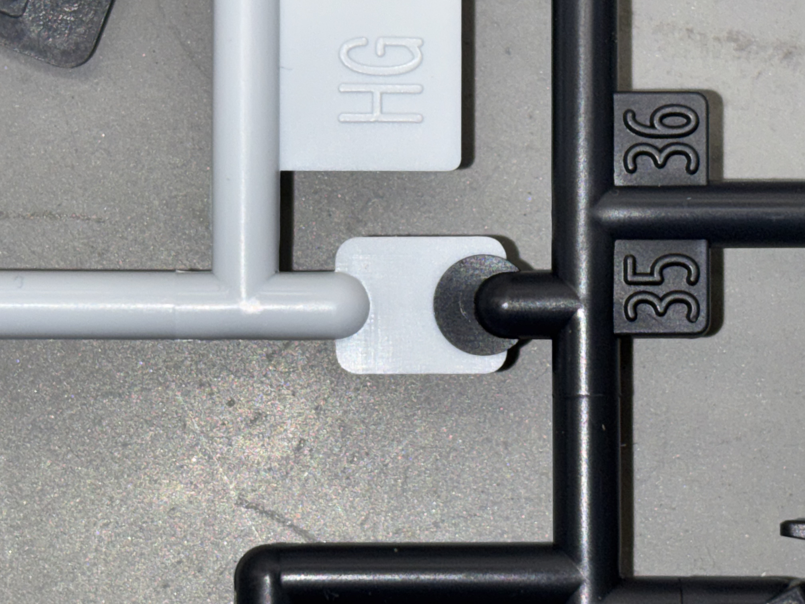
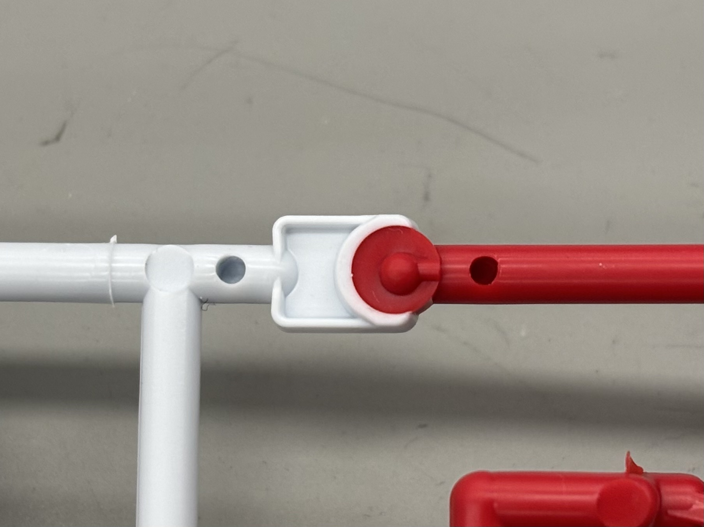
*Figure 5. Front and backside of color transition joins. The backside shows the red shot mechanically captured against the white shot around a core-pin / shutoff feature.*

> **Engineering Constraint:** The four-color limit per machine is not aesthetic. It is a hard ceiling on the System Injection design. Color choices on the kit are downstream of this constraint.

---

## 4. Material Properties

**Board D** — *Why styrenic runners work for armor, why LLDPE works for joints, and why polycaps cannot be glued.*

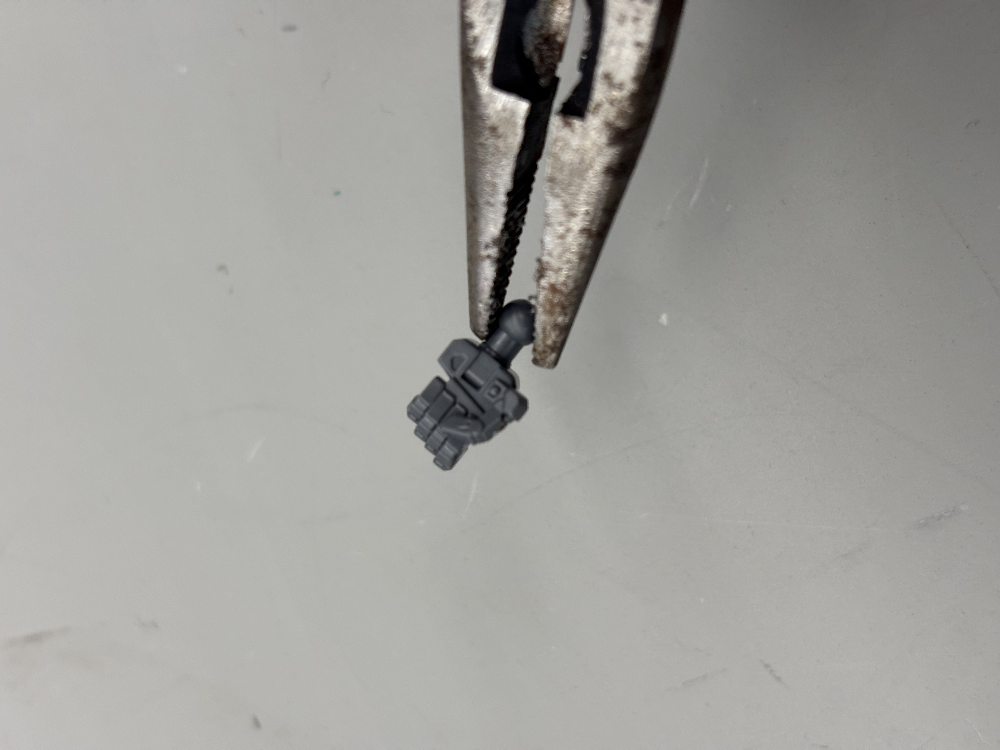
*Figure 1. Rigid styrenic runner sample (left) and LLDPE polycap (right). Two material families physically intermixed across the kit but mechanically belonging to different regimes.*

### 4.1 Property Table

| Property | Styrenic hard runners (SB-13 / Board A) | LLDPE (PC7) |
|----------|:----------------------------------------|:------------|
| Density (g/cm³) | 1.04 – 1.06 | 0.915 – 0.925 |
| Tensile modulus (GPa) | ≈ 1.6 – 2.5 | ≈ 0.2 – 0.5 |
| Tensile strength at yield (MPa) | ≈ 18 – 30 | ≈ 15 – 30 |
| Izod impact, notched (J/m) | ≈ 53 – 107 | No break (ductile) |
| Glass transition / melt T (°C) | Tg ≈ 95 – 100 | Tm ≈ 120 – 125 |
| Crystallinity | Amorphous | Semicrystalline (≈ 30–55%) |
| Injection-molding T (°C) | 190 – 240 | 180 – 240 |
| Surface | Glossy, paint-receptive | Waxy, low-friction |
| Resin code | 6 (PS) | 4 (LDPE/LLDPE) |

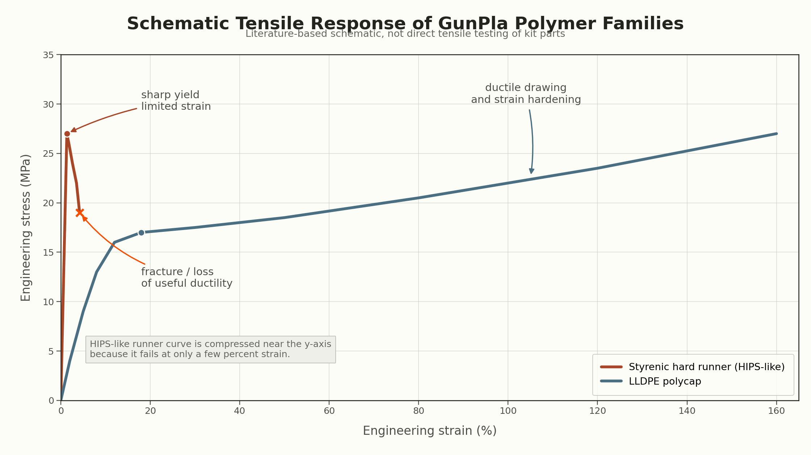
*Figure 2. Schematic tensile stress–strain curves. HIPS-like styrenics show higher stiffness and limited ductility; LLDPE shows lower stiffness and extended ductile drawing.*

### 4.2 Why HIPS for the Armor

HIPS is amorphous — it neither shrinks anisotropically on cooling nor sets up internal crystalline stresses. This allows molded armor pieces to faithfully reproduce sub-millimeter panel lines. Its glass transition Tg ≈ 95–100 °C sits comfortably above all handling temperatures. Its dispersed polybutadiene phase (1–3 μm) raises notched impact toughness by roughly an order of magnitude over general-purpose polystyrene.

### 4.3 Why LLDPE for the Polycap

LLDPE works for polycap joints because of three properties: low modulus (≈0.2–0.5 GPa) gives socket compliance to accommodate diametral interference without cracking; semicrystalline morphology relaxes only slowly under sustained load; and polyethylene's low surface energy (≈31 mJ/m²) means the joint slides cleanly against the HIPS peg without stick-slip.

<video controls src="./assets/bending_polycap.mp4"></video>
*Figure 3. PC7 polycap runner flexed by hand. Visible bending without brittle fracture is the same compliance the joint design uses when a HIPS peg is pressed into a polyethylene socket.*

### 4.4 Why Polycaps Are Not Glued

Polyethylene is non-polar and notoriously difficult to bond. Most cyanoacrylate, model-cement, and epoxy adhesives require a wetting surface energy above ≈35 mJ/m². Without surface treatment (corona, flame, or chemical etch), neither cyanoacrylate nor polystyrene-cement will bond polyethylene. Bandai's design therefore uses interference fit and snap geometry rather than chemical bonding.

> **Design Consequence:** Choosing polyethylene for the polycap forecloses adhesives as a joining strategy. Every articulation point has to be solved with mechanical interference geometry instead.

---

## 5. Environmental Impact

**Board G** — *What happens to the runners after the kit is built.*

### 5.1 What I Wanted to Trace

Every GunPla kit produces a cut "runner skeleton" — the plastic frame left after parts have been removed. I evaluate two end-of-life pathways: (i) the U.S. municipal solid waste stream, and (ii) Bandai's in-house GunPla Recycling Project, operating a closed-loop runner-collection system at Japanese hobby retailers since 2021.

### 5.2 Polystyrene and Polyethylene in the U.S. Waste Stream

| Statistic | Value |
|-----------|------:|
| Tons of plastic generated in U.S. (2018) | 35.7M |
| Plastics recycled | 8.7% |
| Tons of plastic landfilled in U.S. (2018) | 27M |

> **Environmental Risk:** Polystyrene is a C–C-backbone polymer inert to hydrolysis and not metabolized at meaningful rates by ambient microbial communities. It is susceptible to photo- and thermo-oxidative degradation, which fragments the polymer into microplastic and nanoplastic particles. HIPS/PS-rich styrenic runners and LLDPE polycaps are not collected in standard curbside programs — statistically likely to be landfilled.

### 5.3 The GunPla Recycling Project

Bandai Spirits launched the GunPla Recycling Project in April 2021 at participating Japanese hobby stores. Customers return their cut-off "runner skeletons" into in-store collection bins. Three processing pathways:

- **Material Recycling (M)** — Runners crushed, melted, pelletized; re-injected into new kits sold as "Ecopla." Variable, unpainted color is surfaced as a feature.
- **Chemical Recycling (C)** — Runners depolymerized to monomer and re-polymerized. Accepts contamination that mechanical recycling cannot, but is energy-intensive.
- **Thermal Recycling (T)** — Material that cannot be recycled is incinerated with energy recovery.

| Statistic | Value |
|-----------|------:|
| Runner collection locations in Japan | ~200 |
| Collected in fiscal 2024 | 37 t |
| Collected from April 2021 through March 2025 | 117 t |

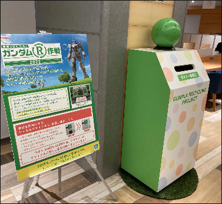
*Figure 1. Runner-collection bin at a participating retailer. Source: Bandai MIRAICREATION.*

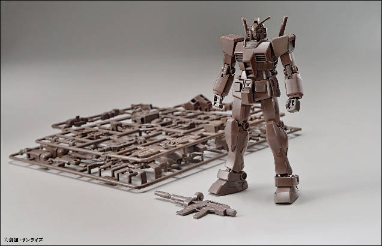
*Figure 2. Ecopla kit. Because the input stream is mixed runner plastic, the recycled material is visually distinct; Bandai presents that difference as part of the product identity.*

### 5.4 Net Assessment

> **Principal Risks:** (a) End-of-life leakage of cut sprue into the curbside waste stream, where it is statistically likely to be landfilled. (b) Microplastic generation from the abrasive cutting and sanding step at the hobby bench. Bandai's Recycling Project addresses (a) but not (b); for (b), the literature recommends wet sanding and over-the-bin disposal.

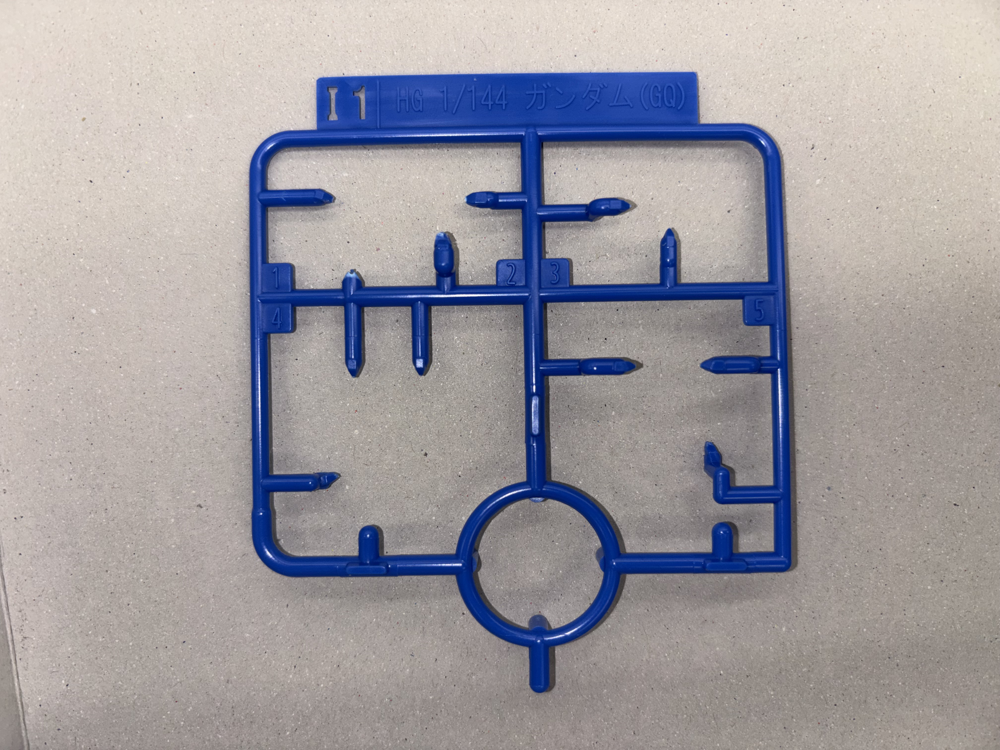
*Figure 3. Cut runner skeleton. The remaining styrenic frame is the exact waste stream Bandai's recycling project targets.*

---

## 6. Assembly Guide

**Board E** — *How a GunPla goes together — and why the polymers, not the builder, are doing most of the engineering work.*

### 6.1 The Build, in One Sentence

Modern GunPla kits are snap-fit, no-glue kits. The assembly procedure exploits the mechanical-property pairing: HIPS pegs interfere with LLDPE polycap sockets to make the joints, and HIPS-on-HIPS cantilever snap-fits hold the armor halves together.

> **Engineering Invariant:** The builder is not deciding when a snap fits. The geometry of the cantilever, the modulus of the HIPS, and the diametral interference of the polycap socket all conspire to produce a click at a specific force.

### 6.2 Tools and Workspace

Thin flush-cut nippers (preferably single-bevel); hobby knife with #11 blade for nub removal; optionally fine sandpaper (#400–#1000); cutting mat. Glue is not used. Paint is optional.

### 6.3 Two-Stage Cutting

Each part is cut from its runner using a two-stage cut: first a coarse cut several millimeters from the part to relieve stress, then a flush cut at the gate. Two-stage cutting reduces the white stress mark caused by polystyrene crazing at the cut edge — a direct consequence of HIPS being a notch-sensitive amorphous polymer.

### 6.4 Polycap Insertion and Snap-Fit Closure

Polyethylene polycaps from PC7 are pressed into the recessed sockets of HIPS armor halves before the halves are joined. Because polyethylene is more compliant than HIPS, the polycap deforms elastically into the socket; once seated, it cannot be easily removed.

Most armor parts are split into left and right halves that join along a centerline. Each half has a cantilever snap feature — a peg with a barbed undercut — that deflects elastically as it enters the mating socket then springs back to lock.

<video controls src="./assets/snapping_parts_together.mp4"></video>
*Figure 1. Snap-fit assembly in progress. The HIPS part is pressed into place by hand, and the joint closes by elastic deformation rather than glue.*

### 6.5 Sub-Assembly Chaining

Sub-assemblies (head, torso, arms, legs, backpack/wings, weapons) are joined via polycap joints in the order specified by the manual. The polycap joints provide post-assembly articulation: rotation, pivot, and ball-and-socket motion.

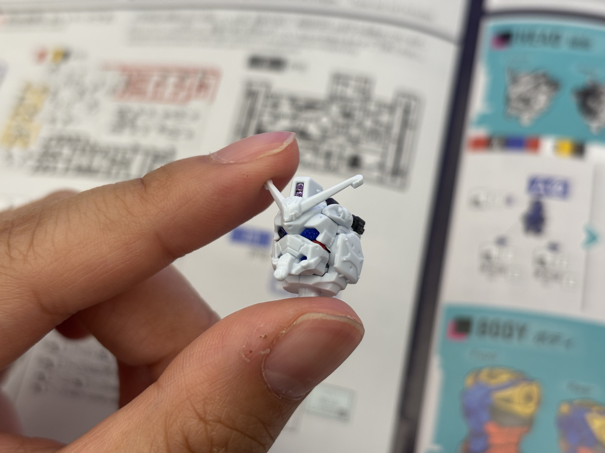
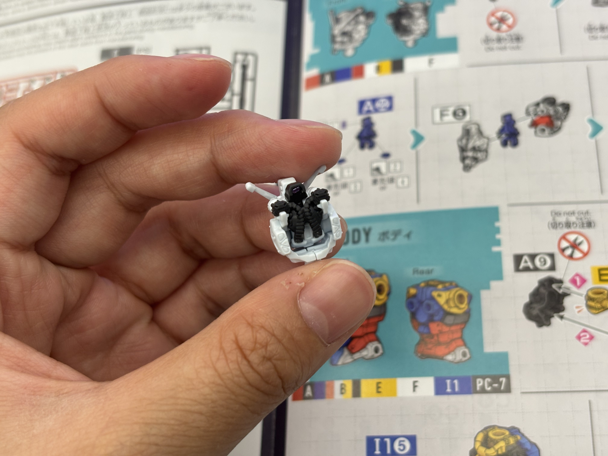
*Figure 2. Front and back of the completed head subassembly.*

### 6.6 Decals and Panel Lining

Stickers or water-slide decals are applied last, and panel-line ink (typically an enamel-based wash) is run into the recessed lines and wiped off. The slight polarity of the styrene matrix allows the wash to wet the panel lines without beading. Polycap surfaces, by contrast, would reject the wash entirely — another consequence of polyethylene's low surface energy.

---

## 7. Historical Context

**Board I1** — *Forty-five years of mold tooling, polymer choices, and grade hierarchy.*

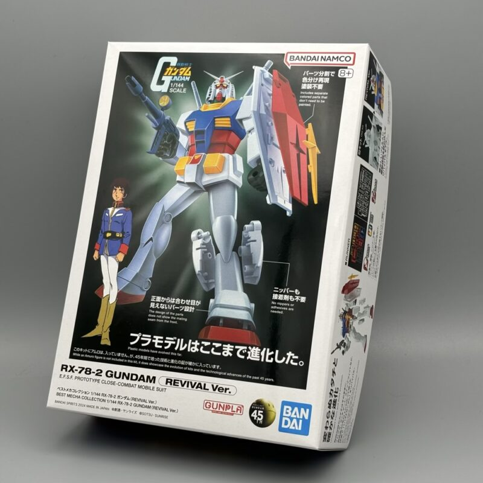
*Figure 1. Best Mecha Collection 1/144 RX-78-2 Gundam (REVIVAL Ver.) package. Source: The Gundam Base official blog.*

### 7.1 Why the History Matters Here

The Wing Gundam kit in front of us is a 30-gram piece of plastic with measurable mechanical properties. Every choice in the kit — from the multi-color runner to the polycap socket geometry — is the product of a specific historical sequence at Bandai. The HG grade did not exist until 1990. The polycap system did not exist before that.

| Statistic | Value |
|-----------|------:|
| First GunPla released (1/144 RX-78-2) | 1980 |
| Cumulative Gundam series model-kit shipments by March 2025 | 810.72M |
| From 1980 launch to 2026 | 46 yr |

### 7.2 Grade Timeline

| Year | Event |
|------|-------|
| 1979 | *Mobile Suit Gundam* premieres on Nagoya Broadcasting (7 April). Redefines the "real robot" mecha sub-genre. |
| 1980 | Bandai releases the first GunPla, a 1/144 RX-78-2, in July. Early kits were monochrome and required paint and glue. |
| 1990 | Introduction of the High Grade (HG) line — first GunPla designed for full snap-fit assembly with multi-color injection molding. |
| 1995 | Introduction of the Master Grade (MG) line at 1/100 scale. Wing Gundam designed by Kunio Ōkawara for *Gundam Wing*. |
| 1997 | Hajime Katoki redesigns the Wing Gundam for the *Endless Waltz* OVA. |
| 1998 | Introduction of the Perfect Grade (PG) line at 1/60 scale — hundreds of parts, LED options, metal-pin reinforcement. |
| 2006 | Bandai consolidates GunPla production at the Bandai Hobby Center in Shizuoka, Japan. |
| 2010 | Introduction of the Real Grade (RG) line at 1/144 scale — back-porting MG inner-frame philosophy into HG form factor. |
| 2021 | Launch of the GunPla Recycling Project: in-store runner collection plus material, chemical, and thermal recycling pathways. |
| 2025 | Bandai Namco reports approximately 117 t of runners collected from April 2021 through March 2025, including 37 t in fiscal 2024. "GunPla Academia" reaches ≈520,000 children across ≈7,100 schools by March 2024. |

### 7.3 The Wing Gundam in Context

The Wing Gundam (XXXG-01W) examined in this report carries 1995-era proportions — long limbs, transformable bird-mode wings — and 2010s-era engineering in its RG/HG-class snap-fit polycap articulation. Thirty years of GunPla engineering compressed into 30–40 g of plastic.

> **About the Wing Gundam:** The kit is a current-production HG Wing Gundam. Its plastic chemistry, mold tooling, and polycap geometry are 2020s-vintage; its silhouette and proportions are 1995/1997-vintage.

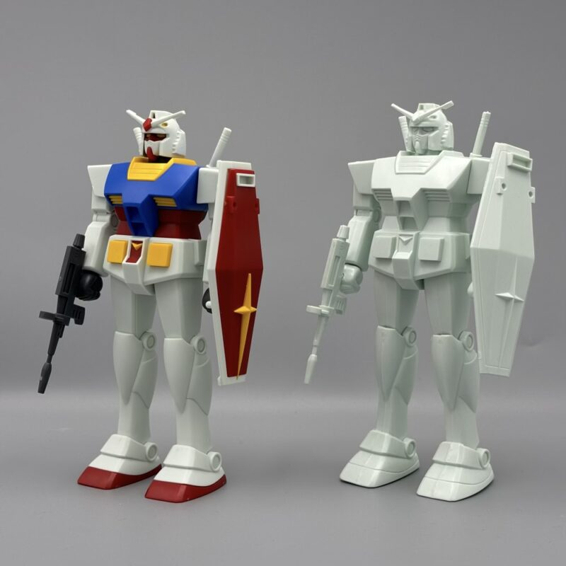
*Figure 3. Bandai comparison of modern REVIVAL Ver. with earlier 1/144 Gundam form. Source: The Gundam Base official blog.*

---

## 8. Design Analysis

**Board F** — *Wall thickness, polycap geometry, and the four-color injection ceiling shape every visible feature.*

### 8.1 What I Looked For

The Wing Gundam stands approximately 13 cm at 1/144 scale, corresponding to an in-universe height of roughly 16.3 m. A single armor part runs 10–20 mm in its longest dimension, and panel-line widths are routinely 0.15–0.30 mm.

| Statistic | Value |
|-----------|------:|
| Model height at 1/144 scale | 13 cm |
| Armor wall thickness | 0.8–1.5 mm |
| Max colors per injection machine | 4 |

*Figure 1. Color blocking maps directly onto runner identity — each runner color is constrained by the System Injection machine's four-color limit.*

### 8.2 Wall Thickness Governs Both Stiffness and Moldability

HIPS armor halves on the HG Wing Gundam are typically 0.8–1.5 mm thick. Below ≈0.6 mm the runner becomes prone to short shots (incomplete fill). Above ≈2.0 mm the part suffers visible sink marks from differential cooling. The 0.8–1.5 mm range is the solution to "stiff enough to survive snap-fit insertion forces" and "thin enough to mold cleanly at HG cycle times."

> **Design Constraint:** Wall thickness is set by physics, not by feel. Thinner kits would need different tooling; thicker kits would lose the panel-line crispness that gives GunPla its visual signature.

### 8.3 Joint Location Is Constrained by Polycap Geometry

Because polycaps are molded as discrete LLDPE inserts, every articulating joint on the kit must be sized around the available polycap inventory. The HG Wing Gundam reuses approximately six distinct polycap shapes for shoulders, elbows, hips, knees, ankles, and the wing-root pivot.

<video controls src="./assets/bending_polycap.mp4"></video>
*Figure 2. The PC7 polycap runner flexed by hand. Several bushing geometries visible on the same frame.*

### 8.4 Color Blocking Maps onto Runner Identity

The five primary colors — white (large surface armor), blue (boots, chest detail), red (shield, accents), yellow (V-fin and trim), and black (joints, weapons) — are constrained by the System Injection machine's four-color limit.

> **Notable Case:** The Wing Gundam's yellow V-fin is one of the smallest and thinnest parts in the kit; its molding tolerance is the limiting case for the entire mold tool. Black HIPS runners commonly carry a higher load of carbon-black pigment (≈2 wt.%), slightly raising the modulus and lowering surface gloss.

*Figure 3. The V-fin is one of the thinnest, smallest features in the kit and the limiting case for the mold tool's filling tolerance.*

### 8.5 Gates and Fill Paths

*Figure 4. Macro of the runner surface where the gate fed the cavity — gate position sets fill path.*

*Figure 5. SB-13 runner section with a long, slender molded part. Long thin geometries are among the hardest shapes to fill without warpage.*

---

## 9. Conclusion & Sources

**Board SB13** — *FTIR assignments and references*

> **Where the spectra live:** FTIR-ATR library-search screenshots for SB-13 (HIPS class), Board A (PS-rich styrenic class), and PC7 (polyethylene class) are the featured figures in the [Plastic Origin](#2-plastic-origin) section.

### 9.1 Key Takeaways

- **SB-13 is HIPS.** FTIR library top matches: "Polystyrene High Impact (Butyl)", "Bunatex", and a polystyrene–ethylene–butylene block copolymer — all converging on rubber-toughened polystyrene.
- **Board A is a PS-rich styrenic runner.** FTIR matches: "Polystyrene High Impact #2", "Polystyrene", and "Poly(styrene-ethylene-butylene)" — close to SB-13, but distinct.
- **PC7 is polyethylene-based.** FTIR matches: "Polyethylene Hostalen GM 7040", "Polyethylene linear low density", and "Paraffin" — consistent with an LLDPE-class polycap.
- **The pairing is engineering, not coincidence.** Stiff amorphous styrenic plastics for visible structure + compliant semicrystalline LLDPE for joints.
- **Multi-color System Injection drives the no-paint promise.** Bandai's up-to-four-color injection machines decouple aesthetic color from post-processing.
- **Closed-loop recycling exists at modest scale.** Bandai's GunPla Recycling Project collected approximately 117 t from April 2021 through March 2025, including 37 t in fiscal 2024.

### 9.2 References

**Peer-Reviewed and Journal Sources**

- Maul, J. F. R. (2004). Super HIPS: improved high impact polystyrene with two sources of rubber particles. *Polymer*, 45(25), 8447–8457.
- Rek, V., Holjevac Grgurić, T., Jelčić, Ž., & Hace, D. (2004). Effect of styrene/ethylene/butylene/styrene block copolymer on the dynamic mechanical behaviour of HIPS. *e-Polymers*, 4(1), 034.
- Choi, J. H., Ahn, K. H., & Kim, S. Y. (2000). Effects of the degree of graft on the tensile and dynamic behavior of high impact polystyrene. *Polymer*, 41(14), 5229–5235.
- Wang, F., Chang, L., Hu, Y., Wu, G., & Liu, H. (2019). Synthesis and Properties of In-Situ Bulk High Impact Polystyrene Toughened by High cis-1,4 Polybutadiene. *Polymers*, 11(5), 791.
- Gulmine, J. V., Janissek, P. R., Heise, H. M., & Akcelrud, L. (2002). Polyethylene characterization by FTIR. *Polymer Testing*, 21(5), 557–563.
- Osteraas, A. J., & Olsen, D. A. (1969). Incorporation of Functional Groups onto the Surface of Polyethylene. *Nature*, 221, 1140–1141.
- Yang, S., et al. (2024). Comprehensive understanding of the aging and biodegradation of polystyrene-based plastics. *Environmental Pollution*, 343, 123181.
- Xu, P., et al. (2024). Progress and Challenges in Polystyrene Recycling and Upcycling. *ChemSusChem*, 17(13).
- Prata, J. C., et al. (2020). Polystyrene nanoparticles: sources, occurrence, distribution and toxicity. *Science of the Total Environment*, 702, 134455.

**Government and Intergovernmental Sources**

- U.S. EPA. [Plastics: Material-Specific Data](https://www.epa.gov/facts-and-figures-about-materials-waste-and-recycling/plastics-material-specific-data). *Facts and Figures about Materials, Waste and Recycling.*
- Ministry of the Environment of Japan / J4CE. Case Study #131: GunPla Recycling Project.

**Academic Handbooks**

- Pu, Z. (2009). [Polystyrene](https://academic.oup.com/book/52773/chapter/421868560). In J. E. Mark (Ed.), *Polymer Data Handbook: Second Edition*. Oxford University Press.
- Prasad, A. (2009). [Polyethylene, Linear Low-density](https://academic.oup.com/book/52773/chapter/421868213). In J. E. Mark (Ed.), *Polymer Data Handbook: Second Edition*. Oxford University Press.

**Manufacturer and Industry Technical Sources**

- Bandai Namco Holdings. [GunPla Recycling Project — Sustainability Actions](https://www.bandainamco.co.jp/en/sustainability/actions/gunpla-recycle.html).
- Bandai Namco Holdings (2025). [*Fact Book 2025*](https://www.bandainamco.co.jp/en/ir/library/assets/pdf/2025/factbook2025_en.pdf). Reports 810.72 million cumulative Gundam series model-kit shipments by March 2025.
- Bandai Co., Ltd. / Bandai Spirits. [Sustainable activities through plastic model kits](https://www.bandai.co.jp/en/miraicreation/plasticmodel/).
- The Gundam Base official blog (2024). [Best Mecha Collection 1/144 RX-78-2 Gundam (REVIVAL Ver.) review](https://www.gundam-base.net/staffblog/60872.html).
- Bandai Spirits Co., Ltd. (2024). [New Factory at Bandai Hobby Center press release](https://www.bandaispirits.co.jp/e/press/2024/241106.php).
- Bandai Spirits Co., Ltd. ECOPLA PROJECT.
- LyondellBasell Industries. Polyethylene (PE) Technologies — Hostalen process bulletin.
- Shimadzu Corporation. Application Note 01-00710-EN: Distinction of Polyethylene and Polypropylene by Infrared Spectroscopy.

**Reference and Review Sources**

- Spectroscopy Online. The Infrared Spectra of Polymers II: Polyethylene; III: Hydrocarbon Polymers.
- Xometry. High-Impact Polystyrene (HIPS): Definition, Properties, and Uses.
- Specialchem. Polyethylene Plastic: Properties, Uses & Application.
- Wikipedia. Mobile Suit Gundam; GunPla; Hajime Katoki; Snap-fit.
- Nippon.com (2019). Gundam at 40: The Influential Anime Series that Redefined a Genre.
- Fictiv. How to Design Snap Fit Components.
- Goonhammer (2024). GunPla Review: Injection Machine.

---

*Material Science Project — MCCI 2026*
